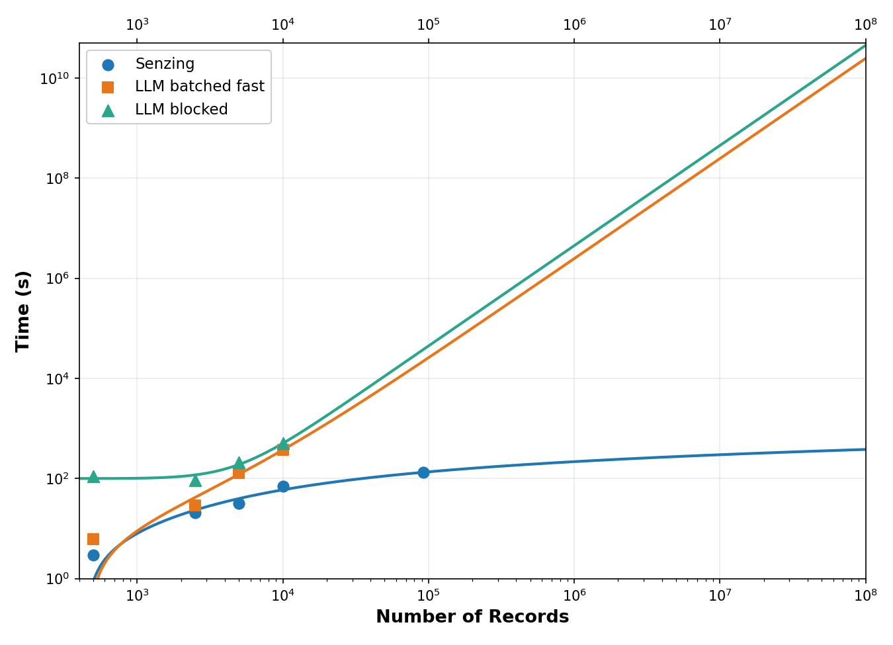
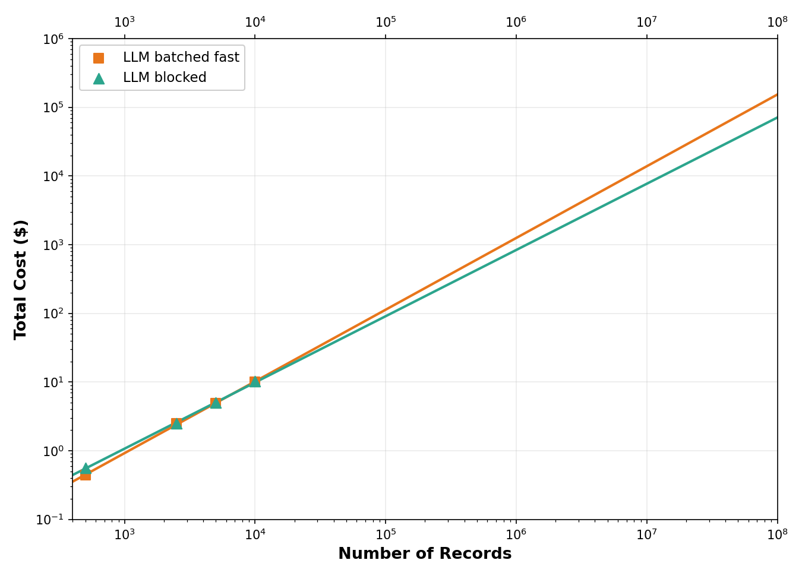
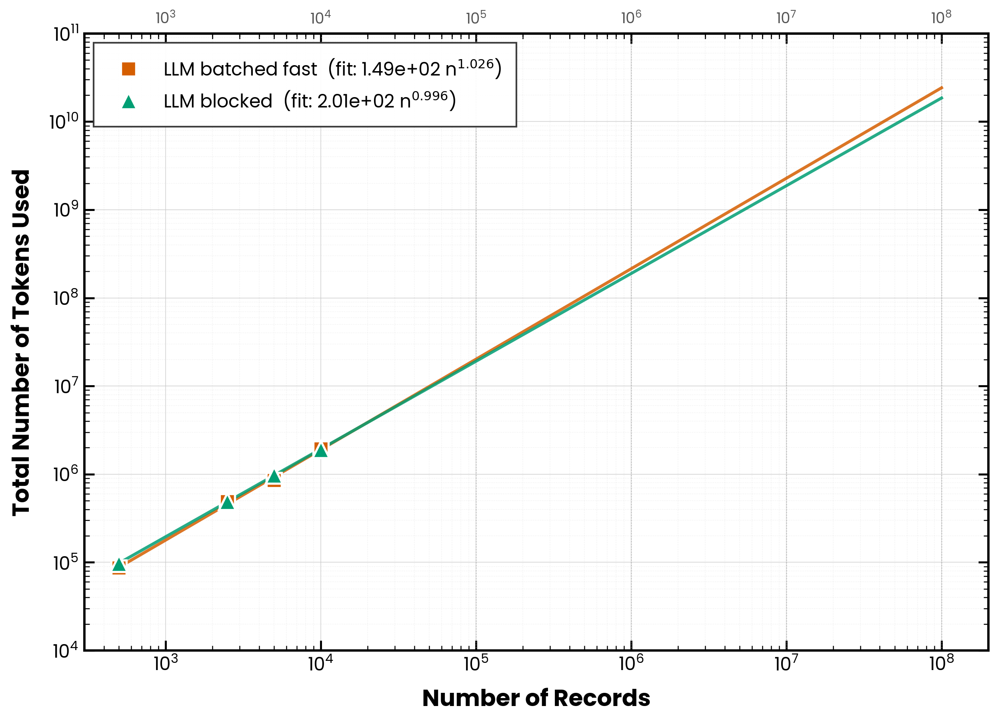
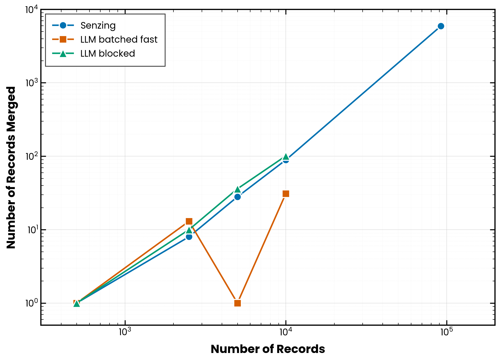

# I Pitted an LLM Against Senzing for Agentic Entity Resolution.  And Whew.

## Tl;Dr

I pitted an LLM against Senzing on entity resolution (ER), and the thing fell apart on cost and time alone.  Senzing resolved all 92,175 records in about two minutes at basically zero marginal cost, while the LLM needed 6-8+ minutes on just 10% of that data at around $10 a run...and that gap only widens as the data grows.  Worse, once you see how it all comes together it will be clear that the only way to dodge that cost is to build the stateful guts of an ER engine yourself, at which point the LLM is just the priciest seat in a car that you had to build anyway.  And none of it gets fixed by a bigger or smarter model...it's structural.

## Introduction

I've been spending a lot of time lately poking at where LLMs actually earn their keep and where they're just expensive vibes in a trenchcoat.  Entity resolution felt like a fair fight on paper...take a pile of records about people, figure out which ones refer to the same human, merge accordingly.  LLMs are supposedly great at fuzzy text matching.  Senzing is a purpose-built ER engine that's been doing this for years.  Let the bake-off begin.

Of course, others have tried ER with LLMs before and gotten mixed results.  However, they notably relied heavily on customizing the data, the prompt, or both [\[1-4\]](#references).  What's different about this experiment is that I didn't reshape the data or hand-engineer a prompt to the benchmark...the LLM got the same JSONL records Senzing got (just converted to CSV for token efficiency).  That makes this less "how high can the LLM score with the right prompt" and more "how does a general-purpose LLM compare to a purpose-built engine when you drop them into the same pipeline slot."

I set out to compare an LLM against Senzing on ER.  I was originally thinking that accuracy is the obvious thing to fight over, and there's a real fight there.  However, as I discovered through experimentation, it is a complicated and nuanced discussion that deserves its own blog post after the initial discussions on how to actually _do_ ER with an LLM are done.  For this post I wanted to focus just on that initial part: the mechanics of using an LLM for ER.  Even more than that though, the surprise is that you don't need the accuracy argument at all.  What I found by actually doing ER with an LLM in terms of cost and time was so convincing that accuracy didn't even matter.  The cost was so prohibitive and the time required was not feasible for true production systems.  And those margins only widen as the data grows for reasons that cannot be fixed by just using a better or bigger LLM.  

Let's start with some of the basics.  ER, when done right, is not a one-time batch job.  Yes, you begin with doing an initial ingestion and resolution of your existing data.  However, it would be very unusual to just stop there.  New records will keep arriving.  So you need to have a system in place to handle that.  And it would be really inefficient to have a system that had to completely re-run the ER process every time it took in a single new record.  

When you think about how an LLM would be doing an ER job, it is doing it as a batch job.  You hand it records, it hands back groupings that ideally correspond to resolved entities.  But what happens when a new record comes in?  This happens all the time.  Your business gains a new customer, a dataset gets updated, or you bring new data onboard your existing platform.  Any time you get new data, whether it is a single record or a complete dataset, you would have to throw _all_ of the data back at the LLM and re-do the complete ER.  The only way around that while still using an LLM would involve the LLM calling a tool that would go out and query an existing database of entities that had already been resolved.  And if you do that, you are essentially just writing your own ER system and not taking advantage of the flexibility that might be available if an LLM actually could do the job.  So you didn't actually skip building an ER engine.  You built one and dropped your most expensive part (the LLM) into its cheapest job.

If you're building production ER at any meaningful scale, you won't get there with an LLM on its own.  This isn't because LLMs aren't smart enough, but because it's the wrong *tool* for the job.  You need a purpose-built ER engine.  The rest of this post shows the work, and why this is structural, not something next quarter's model fixes.

### An Analogy

People buy ER systems for their safety features.  In a way, it is like a car.  People buy cars because, in addition to achieving the outcome of getting you from point A to point B, they provide you with a sturdy metal frame, brakes, a metal exterior around you, seat belts, air bags, etc.  ER systems are pretty similar.  When you buy one you get access to a bunch of safety things like audit trails, deterministic decisions, defensible explanations, reproducible know-your-customer (KYC) / anti-money laundering (AML) / sanctions outcomes.  That's the actual requirement people walk in with: "I need the safest possible vehicle."

So if we take this analogy a bit futher, the LLM-based approach is the car of the future: self-driving demos, touchscreens everywhere, voice interfaces, etc.  The only problem is that the first trip costs more than the car, and to make it street-legal you end up building the chassis, the brakes, and the transmission yourself...at which point the shiny bit you started with is really just a very expensive seat.  The innovations are real.  They just have nothing to do with why anyone walked onto the lot.  Keep that in mind as we start getting into the numbers.  The first half of this post is about what that first trip costs, and the second is about everything you'd have to bolt on to make the thing street-legal at all.

## The Setup

The data came from Senzing's [Las Vegas CORD](https://senzing.com/senzing-ready-data-collections-cord/), which is a free collection of "Senzing-ready" datasets that share a Las Vegas geographic footprint.  CORD stands for Collection Of Relatable Data, and the whole point of these is that the datasets contain overlapping features like names and addresses across different sources, which makes them perfect for testing entity resolution.

I picked two of them...the **Equifax B2BConnect** dataset (firmographic and contact data) and the **US National Provider Index** (a registry of US healthcare providers).  Both CORD snapshots include records for organizations and people, but for this experiment I limited the input to the people-only records from each.  Combined, the two people files come to 92,175 records.  That's not enormous by modern data standards, but it's modestly past the toy-problem threshold.

I ran Senzing on bare metal with PostgreSQL as the backing store, using the Senzing SDK.  For the LLM side, I used Claude Opus 4.8 and prompted it to behave like an ER engine and emit results in the same Senzing JSONL format.  Note that this is the LLM's output — a small result set listing only the merges, kept in Senzing's JSONL export format so both engines produce the same-shaped result, and nested (entities-with-records plus relationships) in a way a flat CSV can't represent.  The input records were fed to the model as CSV for token efficiency, as I describe below.  Same input, same expected output, totally different machinery.

I tested both pipelines at four sample sizes of the dataset, distributed statistically between the two as they are in the complete dataset.  The sample sizes were 500 records, 2,500, 5,000, and 10,000.  Going bigger than 10,000 with the LLM started getting silly on cost and time, so for the full 92,175 I extrapolated mathematically and ran Senzing on the actual file for comparison.  For all three approachs (the two LLM variants and Senzing) I further extrapolated out into the 100M data size, which just gives a real rough ballpark idea on what it would look like to scale these results out to production scale.

### A note on the LLM's output format

It is worth pausing here, because this is where you start to see how much of an ER engine you actually need to mimic when you're playing pretend with an LLM.  I asked Claude to emit Senzing-style JSONL so that I could score both pipelines with the same code.  And it does, sort of.  Each line of LLM output looks like this...

```
{"RESOLVED_ENTITY": {...}, "RELATED_ENTITIES": [...]}
```

with the same top-level field names Senzing uses (`ENTITY_ID`, `ENTITY_NAME`, `RECORD_COUNT`, `RECORDS`, `DATA_SOURCE`, `RECORD_ID`, `MATCH_KEY`, `ERRULE_CODE`).  That was deliberate on my end.  My output-builder was specifically written to mimic the export format so that the same scoring scripts could chew through both files.

But under that thin shell, a real Senzing export carries a lot more freight that the LLM output simply doesn't have.  Things like...

* The `FEATURES` block, with per-entity `NAME`, `ADDRESS`, `PHONE`, `EMAIL`, and `DOB` lists plus usage stats.
* The full original record payload (`JSON_DATA`) for every record in the entity.
* `INTERNAL_ID`, `MATCH_LEVEL`, `MATCH_LEVEL_CODE`, `MATCH_KEY_DETAILS`, and `FEATURE_SCORES` on each record.
* `ECCLASSIFICATIONS`, `ENTITY_NAME_DETAILS`, and `BEST_NAME` on each entity.
* Richer `RELATED_ENTITIES` entries that include `MATCH_LEVEL`, `IS_DISCLOSED`, `IS_AMBIGUOUS`, and a handful of other fields.  The LLM version only writes `ENTITY_ID`, `MATCH_LEVEL_CODE`, and `MATCH_KEY`.

So what the LLM produces is "compatible enough for the scoring scripts" rather than "drop-in interchangeable with a Senzing export."  However, if you feed an LLM-output JSONL into a downstream tool that expects Senzing's full schema (something like `sz_explorer`, or anything that reads the FEATURES or JSON_DATA blocks), it breaks.  This isn't a knock on the LLM exactly.  I didn't ask it to fabricate feature scores or match levels, because those would just be hallucinations dressed up as engineering.  What the LLM _does_ do is match the easy outer layer of the schema cheaply.  But this leaves the evidence and scores that a real ER engine produces, a byproduct of the ER decision making undone.  And that difference between "looks like the output" and "did the work" is an important distinction!

### The two LLM approaches

One quick note before I get into the chunking strategies.  The CORDs ship as Senzing-format JSONL, which is great for Senzing because that's literally what it eats.  For the LLM though, JSON is wildly token-inefficient.  Every field name gets repeated on every record, every quote and brace and colon eats tokens, and you end up paying to serialize syntax instead of data.  So before any of this hit the LLM, I converted the input from JSONL to CSV.  Same fields, same values, but the column headers appear once at the top instead of once per record, and the structural overhead drops dramatically.  In my testing this cut input tokens by roughly 30% compared to sending the raw JSONL through, which directly translates into faster runs and lower bills.  Senzing got the original JSONL because that's its native format.  The LLM got the CSV-converted version of the exact same records.

The next problem I encountered was that I couldn't send all of the data to the LLM at once because of the limits imposed by Anthropic.  First, you need to think about the context window.  Claude Opus 4.8, used in this post, can take a lot of tokens as input in one shot, but not thousands of records plus a prompt.  Then there is the rate-limit and per-request token-cap.  Anthropic enforces celinings on these so even if you can fit all of your data within the context window, you are not allowed to fire it all at once at the API.  So I needed to break the data into chunks.  For this article, I trief two different approaches for the chunking.  And, not surprisingly, how you build the chunks turns out to matter a lot.

The first approach, which I named the **batched fast** approach, fills its chunks by taking records from each data source in roughly the order they came in and rotating between sources.  The goal is throughput.  Which specific records end up together in a chunk is essentially arbitrary, dictated more by file ordering than by content.  In other words, this is the naive "just chunk the records and throw them at the LLM" approach that a lot of people might reach for first.  It's here as the baseline, precisely so we can see what real ER (the blocked approach) has to add on top of it.

The **blocked** approach builds its chunks deliberately.  Records are grouped by the first few letters of the last name (I used four), so that anyone who might be a duplicate of someone else (every "SMITH," every "JONES," every "GARCIA") ends up in the same chunk before being sent to the model.  The specific key doesn't matter — it's just a proxy to get sane block sizes.  Note that there are a ton of different ways that this could be done and I just created a real simple one.  I will say more about this below.

This distinction matters because I theorized that the LLM can only merge two records when it sees them side by side in the same chunk.  If two duplicates land in different chunks, the fast approach will not have the chance to spot them.  The blocked approach is engineered so that they almost always do.

Now let's talk about the same concept from the ER side of the house.  The thing every ER person treats as table stakes is blocking (AKA candidate generation).  Here's the problem it solves.  You can't compare every record to every other record at scale.  That's the O(n²) wall that has always defined ER, and it's brutal.  So every real ER pipeline starts by narrowing the field down to just the records actually worth comparing.  You can do it a bunch of ways...typed keys, blocking on a single field, semantic or vector search, whatever fits your data and use case.  Senzing does it with principled candidate keys.

For the LLM, the chunking IS the blocking.  Think about it...deciding which records should be sent to the LLM at the same time, such as in the blocked approach I described above, is the exact same decision as deciding which records get compared, because the model can only ever merge two records it actually sees together.  Same move, different name.

The bottom line here is that both the LLM approach and the Senzing approach require blocking first.  And it is important to know that good blocking isn't free, which is crucial at scale.  Block on surname and the bucket for common names starts to balloon as your corpus grows.  Every SMITH, every GARCIA...those dense regions of identity space spit out blocks of thousands, not dozens.  So the records the model has to chew through per block keep getting bigger over time, and that's for a reason that has nothing to do with how good the model is.  It is just a fact of life: some individual blocks can get really big and this could confuse or even hit the rate limits on the LLM.  And then the interesting question is what happens to those big blocks once you have surfaced them.

And critically, both LLM approaches saw the exact same input data as Senzing did at each sample size.  Same 500 records.  Same 2,500.  Same 5,000.  Same 10,000.  Apples-to-apples, all the way down.

## What the Numbers Said: Does the Car Move?

Here's the headline figure.  Four panels...time, cost, total tokens used, and number of records merged.  All on log-log scales because the dynamic range gets wild fast.

Let me walk through what jumped out.



| Records | Senzing | LLM batched fast | LLM blocked |
|---:|---:|---:|---:|
| 500 | 2.99 s | 6.1 s | 111 s |
| 2,500 | 20.77 s | 29 s | 93 s |
| 5,000 | 31.96 s | 130 s | 207 s |
| 10,000 | 69.43 s | 371 s | 501 s |
| 92,175 (full) | 131.47 s | (extrapolated, hours) | (extrapolated, hours) |

Senzing on the full 92,175-record dataset finishes in just over two minutes.  Two minutes for the whole thing: load the data, resolve the entities, and write the results to PostgreSQL!  Meanwhile the LLM, at 10,000 records (which is about 11% of the data) is taking over six minutes in the fast variant and over eight in the blocked variant.

Let me be straight about the extrapolation.  I'm not handing you a magic equation.  There are a ton of different equations you could use to fit this data.  The smaller record counts clearly sit on a different slope, and you shouldn't treat any fitted curve as gospel.  But the point is obvious: when you roughly extrapolate out to datasets that are typical production scale, you are looking at many _years_ of runtime.

But here's the thing...you don't actually need the curve.  You just need the mechanism, and once you see it, you'll get why the slope HAS to steepen.

Let's start with what blocking does for you.  It's the only reason ER is tractable in the first place...it stops you from comparing all 92,175 records against each other.  Huge win.  But inside a single block, finding every duplicate STILL means weighing every record against every other record in that block.  And that work is quadratic in the block's size.  Double the records in a chunk and you roughly quadruple the comparison work, while only doubling the tokens you're paying for.  This is the part people miss when they get excited about bigger context windows...a bigger window is a bigger box, not a faster engine.  More room to stuff records in doesn't make the comparisons inside any cheaper.

And here's the kicker, the part blocking does NOT rescue you from.  As the corpus grows, the blocks for common names grow right along with it.  Every SMITH, every GARCIA like we discussed before.  So your most expensive blocks get more expensive faster than the dataset as a whole does.

That's the wall the timing curve is climbing.  And it's exactly why "just use a model with a 10M-token window" makes the economics worse, not better...you're buying a bigger box to hold a problem that punishes you for filling it.

And before anyone says you can parallelize the problem to make it faster...you can, but you can't parallelize away the *work*.  The token bill is identical whether you run it serially or fan it across a thousand API keys, and the fleet of computers you'd need to chew through 100M records in any reasonable window is its own punchline.  You would be standing up a whole datacenter to brute-force what one engine does on a single node.  So yes, you can buy back the wall-clock through parallelization, but you can't buy back the token bill, and you probably can't buy that fleet either.

Senzing's curve barely moves while the LLM curves climb the wall.

### Cost



| Records | LLM batched fast | LLM blocked |
|---:|---:|---:|
| 500 | $0.44 | $0.56 |
| 2,500 | $2.50 | $2.51 |
| 5,000 | $4.93 | $4.98 |
| 10,000 | $10.04 | $10.17 |

Senzing isn't on this chart because Senzing's marginal cost basically isn't there.  You need a license file to run it, so it's not strictly free, but "every run costs you tokens" isn't how it works.  Once you're licensed, the marginal cost of running on more records is just CPU time and IO on a machine you already own.  And Senzing offers a [free non-production evaluation license](https://senzing.com/request-non-prod-license/) you can use to duplicate this experiment yourself.  So for testing, prototyping, and benchmarking like I was doing here, the cost difference is genuinely zero versus ten dollars per 10,000 records.

What my experiments showed was that it cost about ten dollars to process 10,000 records.  This is a pretty steep investment for a really small amount of data!  Extrapolated to the full 92,175 the LLM lands somewhere around $90–$100 per run.  *Per run.*  And sure, you wouldn't re-run the whole corpus constantly when a single new record arrives.  You would resolve it once, persist the results, and manage those new records on arrival.  But that is exactly where "just use an LLM" quietly stops being true, which is the rest of this post.  And again, I included the extrpolation out to typical production scale sizes and you are looking at tens of thousands of dollars per run, or more, which is just not a sustainable cost model.

### Tokens



| Records | LLM batched fast | LLM blocked |
|---:|---:|---:|
| 500 | 86,941 | 93,141 |
| 2,500 | 489,661 | 492,671 |
| 5,000 | 964,027 | 968,657 |
| 10,000 | 1,947,296 | 1,908,223 |

The LLM burned through nearly two million tokens at 10,000 records, with the two variants almost identical.  (Senzing, of course, uses zero tokens because it isn't a language model.)  This figure is mostly here to show the cost numbers above aren't some weird pricing artifact.  The LLM really is doing nearly two million tokens of work to do what Senzing does in a fraction of the time at no marginal cost beyond the license.  None.

And it's a moving target.  These are Opus 4.8 counts, and per Anthropic's own notes the updated tokenizer maps the same input to roughly 1.0–1.35× the tokens that Opus 4.6 used at the same per-token price (independent measurements often land higher).  So "the same job" quietly got more expensive with a version bump, which is its own argument against building your cost model on top of token economics you don't control.

### Records Merged



| Records | Merges found by Senzing |
|---:|---:|
| 500 | 1 |
| 2,500 | 8 |
| 5,000 | 28 |
| 10,000 | 89 |
| 92,175 | 5,931 |

There's one number here worth stopping on, and it's not an LLM versus Senzing thing...it's a why-do-ER-at-all thing.

Watch what happens to the share of records that turn out to be duplicates as the dataset grows.  At 500 records it's about 0.2%.  At 92,175 it's 6.4%.  And it's still climbing!  That's not noise, that's the nature of the beast.

Here's why.  The more data you've piled up, the more likely any given record is a duplicate of something already sitting in there.  Duplicates get found by comparing a record against everything you already know.  So the bigger your "everything you already know" gets, the more chances each new record has to match something.

Which, honestly, is both the entire case for doing ER in the first place AND a sneak peek at the next section.  The right architecture holds onto what it has already resolved and checks every new arrival against it.  A one-shot batch pass over a frozen snapshot like what is happening in the LLM-based approaches is the exact opposite of that.

## Back to Our Analogy: Does the Car Survive the Road?

Everything I showed above is the cost of resolving the data once.  In the real world you'd never redo all that work for every new record.  You would do it incrementally, persisting what you already resolved and only deal with the new arrivals.  But watch what that actually requires, because this is where the "just use an LLM" story falls apart...and none of it gets fixed by a bigger or smarter model.

**To do this incrementally is like building the whole car and the LLM is a really pricey seat in it.**  Persisting your groupings and blocking new records against them is the right call.  But look at what it takes to do it.  You first need a store of *resolved entities*.  These are not raw records.  They are entities that have accreted features across many records, so they know things no single record does.  You also need an index to block new records against and a process that fixes neighboring entities when a new record merges or splits them.  That is the stateful core of an ER engine, and in the LLM world you have to _build all of it yourself._  Do that, and the LLM isn't "the solution" anymore.  It is a scorer dropped into one seat of a full car you built.  And it is the most expensive possible way to fill that seat: tokens and latency on every single comparison, where a principled engine spends almost nothing and gives you the same answer every time.  So reaching for an LLM didn't save you from building ER at all.  It mostly just made the cheapest step in the process the expensive one.

**And your blocking is a cost the LLM can't absorb either.**  Suppose every record is just name, address, and date of birth.  Then one embedding per record and a vector search is truly easy and effective.  But real data is never that tidy.  The moment records get varied, you've got a problem.  Picture a person or business with multiple addresses, missing fields, a handful of different names, several phones, a few employers.  Now you have to actually decide which fields and which combinations to embed.  Because a single whole-record vector just blurs everything together and starts matching on the wrong things.  And if you want relationships like finding people who share an address, you need a separate embedding per address on every record, then another scheme for phones, and so on.  That combinatorial design problem is yours to solve, by hand, and to redo whenever the data shifts.  On top of it, good blocking depends on the statistics of your data.  This includes things like which names are common in your data (which varies by locale) that tells you which value combinations are rare enough to discriminate on.  This is not something LLM's with their internet-scale training know.  Senzing generates those statistics and candidate keys automatically, across features, value combinations, and the multiple values within a record, and learns from your data which ones actually discriminate.  The "just throw it at an LLM" pitch quietly requires you to build the data-aware blocking layer of an ER engine before the LLM resolves a single record.

So the time-and-cost story was never really "the LLM is a little slower and pricier."  It's that you end up stuck between two bad options.  You can either pay the full price resolving the complete data set each time you need ER or you can build the whole stateful engine so you don't have to pay that price more than once.  Then you  realize the LLM was never saving you the hard part anyway.  

And we haven't even had the conversation about the accuracy of the LLM at doing ER.  But we will save that as a post for another day.

## Where an LLM Is Actually Great at This

None of this means embeddings and LLMs are useless for ER work.  There are genuinely good uses, and they're the parts of the stack the LLM is actually shaped for:

* **Schema alignment.**  Bringing a new dataset into your system can be a messy process.  Understanding how different columns are mapped into an existing ER system can be a challenge, like "is `cust_dob` the same as `birth_date`?"  But this is exactly the fuzzy-semantic problem LLMs are great at.  It's a one-time configuration task, not a per-record pipeline.  Senzing's MCP server exposes this directly: an LLM can walk a guided workflow to map source data to the entity specification without ever sending the data to Senzing or even touching the SDK.

* **Candidate generation, AKA the blocking step itself.**  Remember that mandatory step from the setup where we narrowed the field down to the records actually worth comparing?  This is the one spot in the whole ER stack where embeddings genuinely earn their keep.  But only for generating candidates...never for scoring the matches.  Here's when they help.  Most of the time, your typed keys pick out those candidates just fine.  But every so often they miss, usually on messy free-text fields where an exact-match key has nothing to grab onto.  That's where embeddings step in and catch what your keys missed.  Senzing v4 actually lets you wire this up...you can set up a feature built from embeddings that does nothing but help surface candidates, while the real engine still handles every actual matching decision.
But hear me on this.  It's a bonus, not a freebie.  Embeddings are slower than a plain key lookup, and they won't always give you the same answer twice, where a plain key lookup will.  So they belong stacked on top of your typed keys as a little extra insurance...not swapped in to replace them.

* **Field synthesis after resolution.**  Once entities are resolved, LLMs are excellent at summarizing and reconciling free-text fields across the source records.  Genuinely useful, low-risk work.

* **Low-stakes, small-batch dedup.**  A single-pass merge over a few thousand entities extracted from a few hundred documents?  Go for it, an LLM is a fine choice.  It's just not the same problem as production ER.

The structural argument isn't against semantic methods.  It's against swapping them in for the part of the stack — typed candidate generation, principle-based decisioning, real-time learning, deterministic explanations — they can't represent at all.

## What I'd Tell Someone Considering This

If you're building an ER pipeline and you're seriously considering "just use an LLM," I'd push back.  It's still the wrong tool for the job: the one-pass cost is brutal at scale, and the only way to avoid paying it again and again is to build the stateful engine (store, blocking, cascade) that the LLM can't be.  So at that point the LLM is just an expensive scorer you didn't need that will just not work at production scale.

If you're prototyping on a small dataset (say, under 1,000 records) and you want a quick-and-dirty merge pass, sure, an LLM might be fun, albeit expensive.  But the moment you're talking about production data, streaming updates, or a dataset that grows, the numbers aren't close.  Not even a little.  And we haven't even mentioned the quality of these results, which we will save for another post.

I came into this willing to be impressed by the LLM.  I came out impressed by Senzing instead.  Back to our car analogy, the LLM was the shiny seat that cost a lot of money but didn't really make the car go.  It was the car of the future that didn't really drive.  But what I needed was a car that worked.  And Senzing just quietly and inexpensively did the work.

---
## Acknowledgements

I want to thank Paco Nathan, Jeff Butcher, and Brian Macy for their helpful discussions on this topic.

## References

1. Li, Y., Li, J., Suhara, Y., Doan, A., & Tan, W.-C.  *Deep Entity Matching with Pre-Trained Language Models* (Ditto).  arXiv:2004.00584, 2020.  Published in VLDB 2021.  [https://arxiv.org/abs/2004.00584](https://arxiv.org/abs/2004.00584)

2. Peeters, R., Steiner, A., & Bizer, C.  *Entity Matching using Large Language Models*.  arXiv:2310.11244, 2023.  [https://arxiv.org/abs/2310.11244](https://arxiv.org/abs/2310.11244)

3. *Match, Compare, or Select?  An Investigation of Large Language Models for Entity Matching.*  COLING 2025.  arXiv:2405.16884.  [https://aclanthology.org/2025.coling-main.8/](https://aclanthology.org/2025.coling-main.8/)

4. *Structured Multi-Step Reasoning for Entity Matching Using Large Language Model.*  arXiv:2511.22832, 2025.  [https://arxiv.org/abs/2511.22832](https://arxiv.org/abs/2511.22832)

